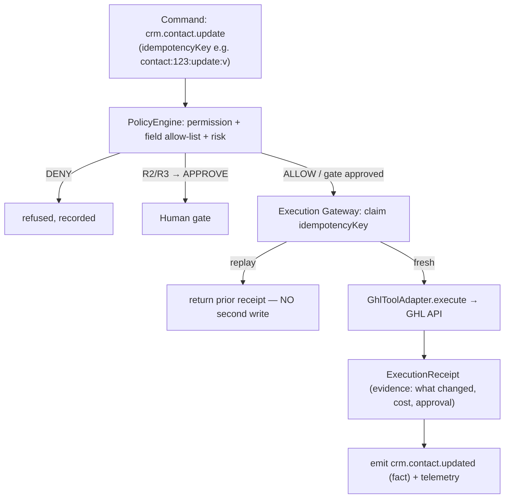

# Design Spec — GoHighLevel as a Governed CRM Tool

- **Drives:** integrating GoHighLevel (GHL) as an external CRM the platform can
  act on, under full control-plane governance
- **Priority:** per-mission (wire when a mission needs CRM writes)
- **Status:** Design — not yet implemented

GoHighLevel is an **external API tool**, one of the execution environments in
[execution-layer.md](https://github.com/Ceoloo/aion-docs/blob/main/architecture/execution-layer.md).
It is *not* a model and *not* an authority: the control plane decides whether a
CRM action is permitted, at what risk, and whether it needs a human gate; the GHL
adapter only performs an already-cleared action and returns a normalized result.

Crucially, GHL is **side-effecting** — updating a contact, sending a message, or
moving a pipeline stage changes the outside world. That makes it the first-class
consumer of the [Execution Gateway](execution-gateway.md): idempotency, receipts,
risk classification, and approval gates all apply.

## Capability taxonomy

GHL actions map onto AION's dotted `domain.action`
[capability](https://github.com/Ceoloo/aion-core/blob/main/src/contracts/capability.ts)
taxonomy, each with a **default risk** and **autonomy tier**
([risk-levels](https://github.com/Ceoloo/aion-docs/blob/main/governance/risk-levels.md),
[autonomy-tiers](https://github.com/Ceoloo/aion-docs/blob/main/governance/autonomy-tiers.md)).
This is the policy-as-code surface the research brief (IBM CUGA) calls for —
enforced structurally, outside the model:

| Capability | Action | Default risk | Side-effecting? | Default tier |
|---|---|---|---|---|
| `crm.contact.read` | fetch a contact | R0 | no | AUTO |
| `crm.contact.search` | query contacts | R0 | no | AUTO |
| `crm.contact.create` | create a contact | R1 | yes | MONITOR |
| `crm.contact.update` | update allowed fields | R1 | yes | MONITOR |
| `crm.note.create` | add a note | R1 | yes | AUTO |
| `crm.opportunity.update` | move pipeline stage | R2 | yes | MONITOR/APPROVE |
| `crm.message.send` | message a customer | R2 | yes (external comms) | APPROVE |
| `crm.contact.delete` | delete a contact | R3 | yes (destructive) | APPROVE |

This mirrors the brief's permission example — an agent may update `name`,
`status`, `notes`, `follow_up_date` but is **restricted** from
`delete_contact` / `export_database` and **requires approval** for
customer-facing sends. Encoded as: allowed fields on `crm.contact.update`;
`crm.contact.delete` and any bulk export are forbidden or R3-gated;
`crm.message.send` maps to R2 external-communication → gate.

## The tool contract (per action)

Each GHL action is a `Tool` ([tool.ts](https://github.com/Ceoloo/aion-core/blob/main/src/contracts/tool.ts))
with its `capability`, default `riskLevel`, and `inputSchemaRef` /
`outputSchemaRef` pointing at data contracts. The **field-level allow-list** for
`crm.contact.update` is part of the tool/permission contract, not left to the
adapter:

```
tool: crm.contact.update
capability: crm.contact.update
riskLevel: R1
allowedFields: [name, email, phone, tags, status, notes, follow_up_date]
forbiddenFields: [do_not_disturb_billing, payment_method, owner]   # example
```

An update touching a field outside `allowedFields` is a policy DENY before
dispatch — the gateway never sends it.

## Governed execution path (why the gateway matters here)



- **Idempotency is essential here.** A retried or resumed run must not send the
  same message twice or double-apply an update. The idempotency key is a natural
  CRM key where possible (`contact:{id}:{action}:{argumentsHash-short}`), so the
  gateway's at-most-once guarantee protects real customer-facing side effects
  ([ADR-003](https://github.com/Ceoloo/aion-docs/blob/main/adr/ADR-003-execution-gateway-and-evidence.md)).
  GHL's own idempotency features, where available, are used *in addition*, but
  AION never relies on the vendor for the guarantee.
- **Receipts are the audit trail** of every CRM change AION made — the evidence
  a human or dispute needs.
- **Events are the business fact:** `crm.contact.updated`, `crm.message.sent` —
  past-tense ([event-standards](https://github.com/Ceoloo/aion-docs/blob/main/engineering/event-standards.md)),
  distinct from the receipt and any downstream outcome.

## The adapter (concrete, kept out of Core)

`@aion/core` defines the `Tool`/`Capability`/`ExecutionAdapter` contracts;
the concrete GHL HTTP client is **vendor code** and does not live in Core (Core
imports no vendor SDK/HTTP integration). It is a thin `fetch`-based adapter,
composed where the platform runs (runtime) or where a product needs it, reading
its token from the environment only:

```ts
// GhlToolAdapter (sketch — lives outside @aion/core)
// base: https://services.leadconnectorhq.com
// headers: Authorization: Bearer ${process.env.GHL_API_KEY}   // value from env only
//          Version: ${process.env.GHL_API_VERSION}            // e.g. 2021-07-28
//          LocationId scoping from ${process.env.GHL_LOCATION_ID}
// canHandle(req): String(req.capability).startsWith('crm.')
// execute(req): map capability → GHL endpoint, return normalized ExecutionResult
//   - never logs the token; failures return a non-secret code (ghl_auth_failed, …)
//   - reports cost.units for tool_cost so economics stays honest
```

The credential contract (env-var names, secret store, rotation) is
[aion-infra/docs/design/external-credentials.md](https://github.com/Ceoloo/aion-infra/blob/main/docs/design/external-credentials.md).
The token is a least-privilege GHL Private Integration scoped to only the CRM
operations these capabilities need — never account-wide admin.

## Least privilege & data classification

- The GHL tool acts under its **own service identity**; it is granted only the
  `crm.*` capabilities a given agent's spec allows
  ([permissions](https://github.com/Ceoloo/aion-docs/blob/main/governance/permissions.md)).
- Contact data is **CONFIDENTIAL/PII**; the adapter passes references and minimal
  fields, and telemetry/receipts store **hashes and references, not raw PII**
  ([observability-standards](https://github.com/Ceoloo/aion-docs/blob/main/engineering/observability-standards.md)).
- Bulk export / whole-database read is not a capability the tool exposes; it is
  forbidden by design (the brief's `export_database` restriction).

## What this spec deliberately does NOT do

- Does not embed a token, location id, or endpoint secret — env/config only.
- Does not put the GHL HTTP client in `@aion/core` — Core stays vendor-agnostic;
  the adapter is composed outside it.
- Does not grant broad CRM credentials and rely on prompts — enforcement is the
  gateway + field allow-lists, structurally outside the model.
- Does not build the adapter before a mission requires CRM writes.
