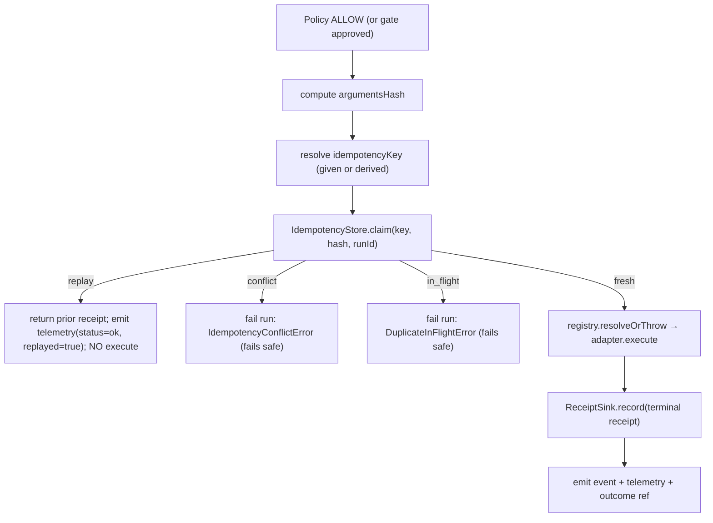

# Design Spec — Execution Gateway (Idempotency, Replay Safety, Evidence)

- **Drives:** [ADR-003](https://github.com/Ceoloo/aion-docs/blob/main/adr/ADR-003-execution-gateway-and-evidence.md),
  [architecture/execution-gateway.md](https://github.com/Ceoloo/aion-docs/blob/main/architecture/execution-gateway.md)
- **Priority:** P0 (contract now; enforcement when the first side-effecting
  mission attaches)
- **Status:** Design — not yet implemented

## What Core has today

The Phase 1 lifecycle is:

```
Orchestrator.submit(CommandInput)
  → mint RunContext (run_id, correlation_id, ...)
  → PolicyEngine.evaluate(Command) → ALLOW | DENY | REQUIRE_APPROVAL
  → deny | ApprovalGate (pause → resume same run) | ExecutionRegistry.resolve → adapter.execute
  → ExecutionResult → OutcomeReference
  → EventEmitter + Telemetry at each step
```

There is **no** idempotency key, **no** argument fingerprint, and **no** durable
per-side-effect receipt. Resuming after a gate, or retrying a failed step, can
re-run an external side effect. This spec closes that gap **inside the existing
lifecycle**, without a new subsystem.

## Contract additions

### 1. `IdempotencyKey` (new branded id) + `argumentsHash`

```ts
// contracts/idempotency.ts
export const IdempotencyKey = z.string().min(1).max(200).brand('IdempotencyKey');
export type IdempotencyKey = z.infer<typeof IdempotencyKey>;

/** Canonical, stable hash of the arguments that actually reach the tool. */
export const ArgumentsHash = z.string().regex(/^sha256:[0-9a-f]{64}$/).brand('ArgumentsHash');
export type ArgumentsHash = z.infer<typeof ArgumentsHash>;
```

**Where the key comes from.** Preference order:

1. **Caller-supplied natural key** on `CommandInput` (e.g.
   `invoice:INV-1042:send`). Preferred whenever the domain has one — it makes
   the at-most-once boundary meaningful to the business, not just the process.
2. **Deterministically derived** by the control plane when none is supplied:
   `derive(capability, argumentsHash, scope)` where `scope` is the natural
   dedup scope (usually `run_id`, or `mission_id` for cross-run natural keys).

The key is **required** for capabilities whose default `riskLevel` is `R2+`
(external / harder-to-reverse) and for any command flagged `sideEffecting`;
**optional** for `R1`; **absent** for pure-read `R0`.

**Canonical argument hashing** (`argumentsHash`) is specified once so equivalent
calls hash identically:

- serialize the *resolved* tool arguments (post-defaulting) as canonical JSON:
  object keys sorted lexicographically, no insignificant whitespace, numbers in
  shortest round-trip form, explicit `null`s preserved;
- exclude fields declared `volatile` in the tool contract (timestamps,
  client-generated nonces) so retries of the same logical action still match;
- hash with SHA-256, prefix `sha256:`.

Hashing is a pure Core utility (`observability`/`contracts` adjacent); it imports
no crypto vendor beyond Node's `node:crypto` already used by `identifiers.ts`.

### 2. `Command` / `ExecutionRequest` carry the new fields

`Command` gains optional `idempotencyKey` and a derived-at-dispatch
`argumentsHash`; `CommandInput` gains optional `idempotencyKey` and a
`sideEffecting?: boolean` hint. `ExecutionRequest` (execution-adapter.ts) carries
both so an adapter *may* pass them to an idempotent downstream API, but is never
**trusted** to enforce them — enforcement is Core's.

### 3. `ExecutionReceipt` (the evidence record)

```ts
// contracts/receipt.ts
export const RECEIPT_STATUSES = ['succeeded', 'failed'] as const; // terminal only
export const ReceiptStatus = z.enum(RECEIPT_STATUSES);

export const ExecutionReceipt = z.object({
  receiptId: ReceiptId,                 // new branded id, prefix "rcp"
  idempotencyKey: IdempotencyKey,
  runId: RunId,
  requestId: RequestId,
  missionId: MissionId.optional(),
  capability: Capability,
  toolId: ToolId.optional(),
  argumentsHash: ArgumentsHash,
  riskLevel: RiskLevel,
  approvalState: ApprovalState,         // reuse telemetry ApprovalState
  autonomyTier: AutonomyTier.optional(),// see below
  executor: z.string().min(1),          // which adapter/runtime ran it
  model: z.string().optional(),
  status: ReceiptStatus,
  cost: ExecutionCost,                  // reuse result.ts ExecutionCost
  resultReference: z.string().optional(),// pointer, not the payload
  startedAt: z.string().datetime(),
  completedAt: z.string().datetime(),
  metadata: z.record(z.unknown()).default({}),
});
```

A receipt is **authoritative and terminal**: it is written once per idempotency
key, only for a completed (succeeded/failed) side effect. It is distinct from
telemetry (sampling-tolerant observation) and from events (business facts).

## New ports (Core defines, aion-data implements)

```ts
// ports/idempotency-store.ts
export interface IdempotencyStore {
  /**
   * Atomically claim the key for this run before dispatch. Returns:
   *  - { state: 'fresh' }                        → first time; proceed to execute
   *  - { state: 'replay', receipt }              → terminal receipt exists; DO NOT execute
   *  - { state: 'in_flight' }                    → another attempt holds the key; do not double-dispatch
   *  - { state: 'conflict', existingHash }       → key reused with a different argumentsHash
   */
  claim(input: {
    key: IdempotencyKey;
    argumentsHash: ArgumentsHash;
    runId: RunId;
  }): Promise<IdempotencyClaim>;
}

// ports/receipt-sink.ts
export interface ReceiptSink {
  /** Append a terminal receipt. Idempotent on (idempotencyKey). */
  record(receipt: ExecutionReceipt): Promise<void>;
  get(key: IdempotencyKey): Promise<ExecutionReceipt | undefined>;
}
```

Phase-1-style **in-memory adapters** ship in Core for tests; the durable
implementations live in aion-data
([economics-and-idempotency.md](https://github.com/Ceoloo/aion-data/blob/main/docs/design/economics-and-idempotency.md))
and are wired by aion-runtime. This mirrors the existing `RunRepository` /
`EventSink` / `ApprovalStore` pattern exactly — no new dependency direction.

## Orchestrator changes (the enforcement point)

The gateway is the segment of `Orchestrator` between "policy cleared" and
"adapter dispatched". Enforcement:



- **The claim happens on every dispatch**, including a resume from
  `awaiting_approval` and any retry — so replay safety spans the whole run, not
  one call.
- **A denied action never reaches the claim** (existing invariant: denial short
  circuits before execution).
- **Fail-safe on ambiguity.** `conflict` and `in_flight` transition the run to
  `failed` with a structured error rather than risk a double side effect.
- **Receipt write is part of completing the step.** A step is not "done" until
  its terminal receipt is recorded; if the receipt write fails, the step is
  `failed` and the key is not marked terminal, so a later retry can proceed.

New errors (errors/index.ts, stable `code`): `IdempotencyConflictError`,
`DuplicateInFlightError`, `ReceiptWriteError` — all with machine-readable codes,
consistent with the existing error taxonomy.

## Graduated autonomy in the policy decision

Per [autonomy-tiers.md](https://github.com/Ceoloo/aion-docs/blob/main/governance/autonomy-tiers.md),
the policy engine additionally returns an **autonomy tier**:

```ts
export const AUTONOMY_TIERS = ['AUTO', 'MONITOR', 'APPROVE', 'DENY'] as const;
export const AutonomyTier = z.enum(AUTONOMY_TIERS);
```

Mapping (deterministic, central; the worker never raises its own tier):

| PolicyDecision today | Autonomy tier | Behavior |
|---|---|---|
| `DENY` | `DENY` | refuse, record |
| `REQUIRE_APPROVAL` | `APPROVE` | existing human gate |
| `ALLOW` + capability marked `monitored` (or R2 un-gated) | `MONITOR` | execute, emit a real-time notice, remain abortable |
| `ALLOW` otherwise | `AUTO` | execute, record |

This is **additive**: `PolicyDecision` gains an `autonomyTier` field; the existing
`decision` enum is unchanged, so nothing downstream breaks. `MONITOR` reuses the
existing execution path plus a telemetry/notification hook — no new gate
machinery. R3 can never map to `AUTO`/`MONITOR` (enforced in the mapping, not
left to config).

## Honest cost capture (feeds economics)

The gateway is where cost is *observed*, so it is where economics gets honest
inputs (ADR-004). At receipt time, split the existing `ExecutionCost` where
knowable:

- `compute_cost` — model/compute units reported by the adapter;
- `tool_cost` — units attributable to the invoked tool (from the tool contract's
  declared cost, or the adapter's report);
- `tokens` — as today.

Core records these on the receipt and telemetry; it does **not** compute ROI or
store economics (that is aion-data's derived layer). Core's job is that the raw
cost is captured at-source and authoritative.

## What this spec deliberately does NOT build

- No distributed lock / exactly-once across arbitrary external systems — the
  guarantee is **at-most-once at the gateway** (ADR-003, honest bound).
- No storage engine or index choice — that is aion-data's, ADR-gated if the
  hot-path read outgrows the primary table.
- No sandbox — programmatic execution and its multi-tool idempotency are the
  sibling spec.
- No production notification transport for `MONITOR` — that is an infra/adapter
  concern; Core emits the hook.

## Invariants (restating ADR-003 at the code boundary)

- Every state-changing execution passes through the claim → dispatch → receipt
  path; there is no side door.
- At-most-once per `idempotencyKey`, across retries and resumes.
- `argumentsHash` mismatch on a reused key fails safe.
- Idempotency, hashing, receipts, and tier selection are Core-enforced; no
  adapter self-enforces them.
- Receipts are terminal and append-only.
