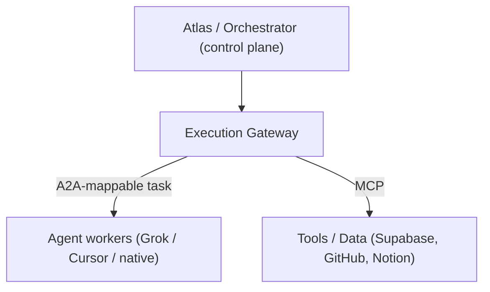

# Design Spec — Programmatic Execution & A2A Compatibility

- **Drives:** [2026 Runtime-Control Brief](https://github.com/Ceoloo/aion-docs/blob/main/research/2026-runtime-control-brief.md)
  signals 2 (CodeAct/PTC) & 5 (A2A)
- **Priority:** P1 (programmatic execution — prototype & measure) / P2 (A2A —
  design for mapping, do not adopt)
- **Status:** Design — not yet implemented

This spec covers two forward capabilities that share one theme: reducing wasted
model turns and keeping AION portable. Both are expressed as **additions behind
the existing execution-adapter boundary** — no new control-plane concepts.

---

## Part 1 — Programmatic Execution (P1)

### The problem

Chaining deterministic operations through the model wastes turns and tokens:

```
Agent → Supabase → Agent → Airtable → Agent → scoring → Agent → CRM
```

Every arrow through "Agent" is a model round trip. The brief's benchmark
(CodeAct) shows collapsing these into one sandboxed program cut a representative
workload 52% in latency and 64% in tokens, without giving the model unrestricted
machine access (the program ran in a fresh micro-VM).

### The three workload classes

AION already separates two; this spec names the third:

| Class | Example | Executed by |
|---|---|---|
| **LLM reasoning** | ambiguity, judgment, planning | model, per-turn |
| **Deterministic execution** | one API/SQL/transform call | an execution adapter |
| **Programmatic orchestration** *(new)* | chain many deterministic ops in one plan | a **sandboxed plan adapter** |

### Design: a plan is a bounded program, executed as one governed unit

```
Agent generates execution plan → gateway governs it → sandbox executes → agent evaluates result
```

Key decisions:

1. **A plan is a first-class intent, not free code.** Core defines an
   `ExecutionPlan` contract: an ordered/DAG set of **steps**, each naming a
   `capability` + `toolId` + arguments (possibly referencing prior step
   outputs). The plan is data the policy engine can inspect — not opaque
   JavaScript the control plane cannot reason about.

   ```ts
   export const PlanStep = z.object({
     stepId: z.string().min(1),
     capability: Capability,
     toolId: ToolId.optional(),
     arguments: z.record(z.unknown()).default({}),
     dependsOn: z.array(z.string()).default([]),   // prior stepIds
   });
   export const ExecutionPlan = z.object({
     planId: PlanId,                                // new branded id "plan"
     steps: z.array(PlanStep).min(1),
     metadata: z.record(z.unknown()).default({}),
   });
   ```

2. **Policy is evaluated per step, before the plan runs.** Every step's
   capability/tool/risk passes the existing `PolicyEngine`. The plan's risk is
   the **highest** step risk (`highestRisk`, already in `risk.ts`). If **any**
   step is `DENY`, the plan is rejected before execution; if any step requires
   approval, the plan pauses at a gate presenting the whole plan. Governance is
   not bypassed by batching — this is the OpenAI-PTC guarantee ("approvals,
   guardrails, tracing, pause/resume still apply") expressed in AION terms.

3. **The gateway wraps every step.** Each step goes through the same
   idempotency-claim → dispatch → receipt path as a standalone execution
   ([execution-gateway.md](execution-gateway.md)). A plan's idempotency key is
   composed of the plan key + `stepId`, so a **re-run of a partially-completed
   plan resumes from the first step without a terminal receipt** — replay safety
   for multi-tool plans is a superset of the single-call guarantee, not a new
   mechanism.

4. **The sandbox is infra, not Core.** Core defines a `PlanExecutionAdapter`
   (an `ExecutionAdapter` whose capability is `plan.execute`) and the
   `ExecutionPlan` contract; the *isolation technology* (micro-VM / V8 isolate)
   is chosen and operated by aion-infra
   ([programmatic-execution-sandbox.md](https://github.com/Ceoloo/aion-infra/blob/main/docs/design/programmatic-execution-sandbox.md)).
   Core never runs untrusted code itself and never learns which sandbox backs the
   adapter.

5. **Ship it as a measured prototype, not a default.** Per the brief's P1
   framing: build the plan path, run representative high-tool-count workflows
   through both the standard agent loop and the plan adapter, and compare tokens
   + latency + correctness before making it a routing default. The comparison is
   an [eval](https://github.com/Ceoloo/aion-docs/blob/main/engineering/evals.md),
   recorded, not asserted.

### What programmatic execution does NOT change

- No new policy outcome, risk taxonomy, or gate type — plans reuse all of it.
- No model gets machine access — steps are declared capabilities, run in a
  sandbox, governed per step.
- Core does not execute code; it validates plans and routes to the adapter.

---

## Part 2 — A2A Compatibility (P2 — map, don't adopt)

### Stance

The Agent2Agent protocol is maturing into the *Agent ↔ Agent* layer, with MCP as
the *Agent ↔ Tools/Data* layer. AION should **not** rebuild around A2A today. It
**should** shape its internal message/task schemas so they map cleanly onto A2A
later — preserving portability without making a young standard a critical
dependency. This mirrors AION's existing capability-over-vendor rule.

### Where the layers sit



- **A2A** = how the control plane dispatches a unit of work to an agent worker.
  In AION terms this is already the `ExecutionRequest` handed to an adapter.
- **MCP** = how a worker/tool-adapter reaches tools and data. Already the tool
  boundary.

### Design: keep the internal contracts A2A-mappable

No A2A code. Instead, three cheap constraints on existing/near contracts so a
future `A2AExecutionAdapter` is a thin translation, not a redesign:

1. **A unit of work is self-describing.** `ExecutionRequest` already carries
   goal (command), capability, risk, and context-by-reference — the same fields
   an A2A "task" carries (id, skill/capability, input, artifacts-by-reference).
   Keep context passed **by reference**, so it maps to A2A artifacts rather than
   inlined blobs.
2. **Results are normalized and status-typed.** `ExecutionResult`
   (succeeded/failed + structured error + cost + references) already matches an
   A2A task's terminal states. Keep failures first-class (they map to A2A failed
   states) — never a thrown surprise.
3. **Identity and trace propagate.** The ID chain
   ([observability](https://github.com/Ceoloo/aion-docs/blob/main/architecture/observability.md))
   maps to A2A task/correlation ids; keep `run_id`/`correlation_id` on every
   request so an A2A handoff stays in one trace
   ([agent-trace-schema](https://github.com/Ceoloo/aion-docs/blob/main/engineering/agent-trace-schema.md)).

### The one guardrail

An A2A adapter would let AION dispatch to **external** agents. That is an
execution environment like any other and gets a **least-privilege identity** and
full gateway governance ([execution-layer](https://github.com/Ceoloo/aion-docs/blob/main/architecture/execution-layer.md)
rule #2): an external agent reached over A2A is still bound by permissions,
risk, gates, idempotency, and receipts. A2A is a transport, never an escape from
the control plane.

### What A2A compatibility does NOT do now

- No A2A client/server, no protocol dependency, no agent-card publishing.
- No assumption that A2A is final — if it changes, only a future adapter +
  mapping table changes; the internal contracts do not churn.
- No mandatory A2A path — native and in-process adapters remain first-class.

## Follow-up

- A future ADR selects the **sandbox technology** (infra) when the first
  high-tool-count mission justifies programmatic execution.
- A future ADR decides **whether/when to adopt A2A** (not just map to it) when a
  real cross-vendor agent-to-agent mission requires it.
